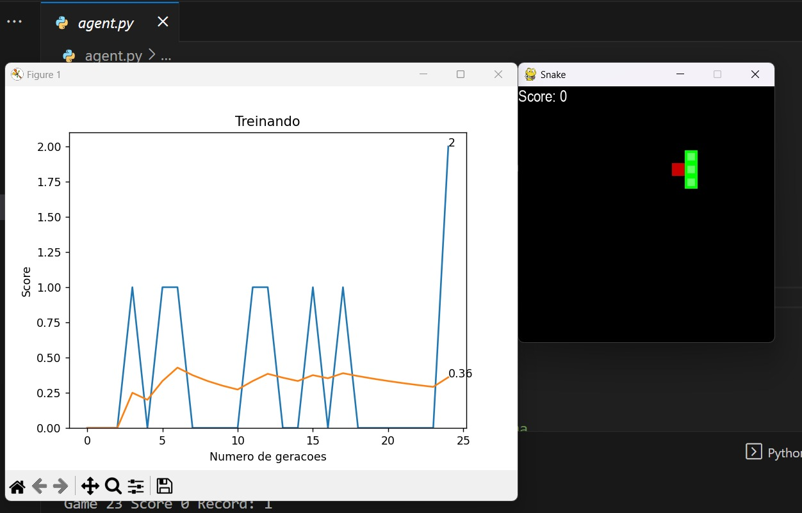

# Snake-game-IA

    

## Tecnologias 💻

Esse projeto foi desenvolvido com as seguintes tecnologias:

-Python  
-Pygame  
-GitHub e Github Desktop

## Projeto 😁

Este projeto foi desenvolvido durante um minicurso de Inteligência Artificial em Jogos, realizado durante a Semana da Tecnologia no IFTM Campus Uberaba. A participação nesse minicurso me permitiu aprimorar meus conhecimentos em Inteligência Artificial e a linguagem de programação Python.

O Snake Game IA, é um projeto ao qual você tem duas opções:

    • Executar o arquivo main.py para ativar o clássico jogo da cobrinha, ao qual poderá controlar e se divetir normalmente;

    • Executar o arquivo agent.py para ativar o treinamento da IA com o objetivo de perseguir a comida sem resultar em um game over. Além da interface da IA treinando no jogo, também será exibido um gráfico para acompanhar a quantidade de tentativas geradas e o respectivo score em cada uma delas.
 
